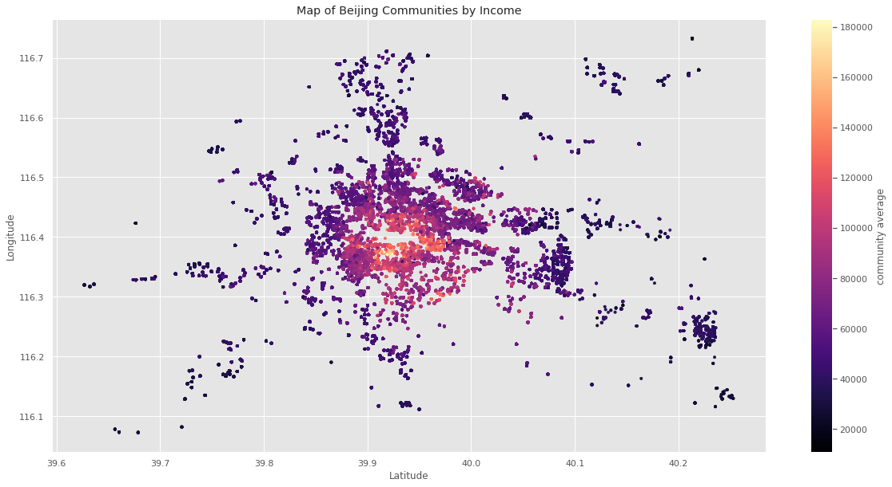

# Beijing Housing Predictions based on community average income and current housing market
## Throughout this project I will be exploring and visualizing the positive correlation between housing prices and community income.
**Cheyenne Quann**: 
### Business problem: How can we predict where the highest priced listings will present themselves as to increase our monthly commission as an agency
### Data: 
The data used to make my analysis is
/content/drive/MyDrive/Coding Dojo/DataSets/200khouses.csv This dataset contains all pertinent information about Beijing's housing market, coordinates of each house and the average incomes of every community present in the dataset
  Methods:
- Data preparation steps with explanation and justification for choices
- I will familiarize myself with the data by going through it extensively 
- The data will be cleaned to allow for cleaner processing, readability and analysis
-I will check correlations and create visuals for presentation purposes
- I will implement machine learning models that would best be able to predict where the highest paying listings are concentrated based off of the provided data 
-I will recommend the best model to use depending on how well fit my evaluation metrics are in my chosen regression models
## Results

## Analysis of visuals
My plots show a map of the Beijing communities coloring each point by price of homes in the first plot and by the aver community income in the second plot.
My first observation was that of course the maps are identical but the community average income plot differs from the price map plot in that toward the center of the plot there is a higher concentration of high incomes.
The closer one moves to 39.9 lat, 116.4 lng the more expensive the homes. Thus visualizing what my correlation plot plots have may clear. There is a strong positive correlation between the prices of the homes and the incomes of the people that live in those communities.
## Model
I chose to implement a linear regression model with both ridge and lasso tunings to make predictions based on the dataset with which I conducted my project. It performs well in comparison to my alternate model, albeit with slight underfitting. The accuracy and RMSE scores are almost identical and by using this model the client will be able to predict the next home's price within 14,500 dollars. This model could have several practical uses depending on how it is modified. The current code and model would be most useful to a real estate agency or residential home investor looking to gauge where the most expensive listing will be and expand their holdings.

## Recommendations:
Based on my findings, I believe any agency that wants to up their revenue and holdings should invest their time and energy into acquiring clients and properties from these neighborhoods in the center of my plot.
## Limitations & Next Steps
The limitations to this project are that I don't have a way of knowing if the people that reside in the brightly colored center area are interested in selling. Given the density of wealth it is possible the families have been there a long time, they may be affluent and intent on maintaining their property. My next steps would be to canvas the areas and find out just what kind of communities they are and how attached to the land are the people in the communities I've studied.
### For further information
For any additional questions, please contact **Cheyenne.quann@gmail.com**
